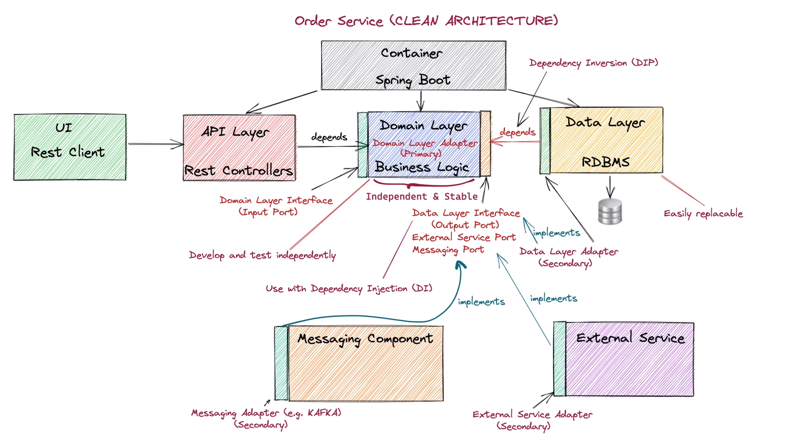
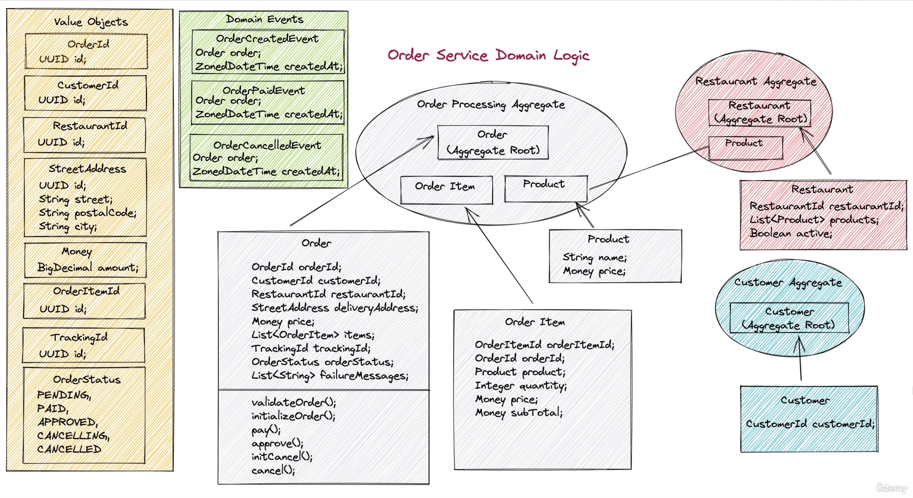

# Food Ordering System :: DDD


[](https://github.com/tacsio/food-system-ddd/issues)
[](https://github.com/tacsio/food-system-ddd/graphs/commit-activity)


## :package: System Architecture



#### :bangbang: Attention

> **order-omain-core** should not have any dependencies. 
> That component should be the most stable component in the system
> since it have the business logic.

> **order-application-service** should not have either any external dependencies.

### :wrench: Generating Modules Architecture with Maven Depgraph plugin

> Depends on graphviz

```bash
mvn com.github.ferstl:depgraph-maven-plugin:aggregate -DcreateImage=true -DclasspathScope=compile -DshowGroupIds -DshowVersions "-Dincludes=com.food.ordering.system*:*"
```

### :package: Order Service Domain

